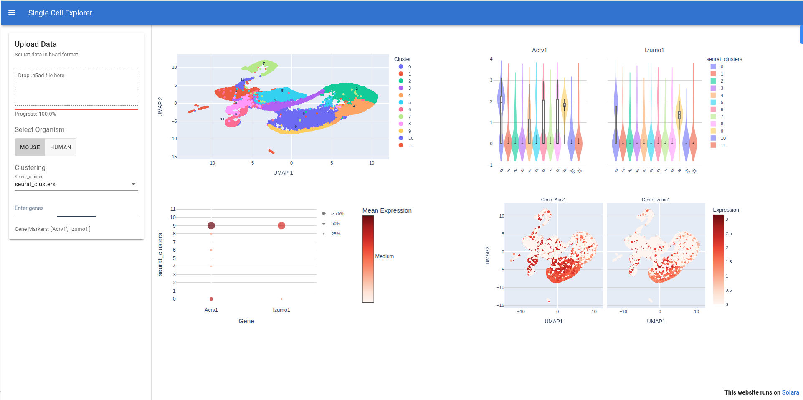

# Single Cell Explorer

A web-based application for visualizing and exploring single-cell RNA sequencing data, built with [Solara](https://solara.dev/). It enables users to upload `.h5ad` files (e.g., Seurat data), select clustering resolutions, input gene markers, and generate interactive UMAP, violin, dot, and feature plots. The application runs seamlessly using **Singularity v4.3.1-noble**, which encapsulates all dependencies, eliminating the need for manual environment setup. 

## Key Features
- Data Upload: Users can drag and drop .h5ad files containing single-cell data, which must include UMAP embeddings (X_umap) and clustering annotations (e.g., RNA_snn_res.*, seurat_clusters). The application processes the data and provides real-time progress updates via a progress bar.
- Cluster Selection: A dropdown menu allows users to select different clustering resolutions available in the dataset, triggering immediate updates to all visualizations.
- Gene Input: Users can enter gene markers (comma- or space-separated) in a text field, with validation against the dataset’s gene list. Invalid genes trigger error messages with suggestions.

Interactive Visualizations:
- UMAP Plot: Displays cells in a 2D UMAP space, colored by cluster, with centroids labeled for clarity.
- Violin Plot: Shows the distribution of gene expression across clusters, with mean expression bars.
- Dot Plot: Visualizes the percentage of cells expressing each gene and their average expression per cluster, using dot size and color.
- Feature Plot: Maps gene expression levels onto UMAP coordinates, with a color scale indicating intensity.

## Features
- **File Upload**: Upload `.h5ad` files containing single-cell data with UMAP embeddings.
- **Cluster Selection**: Dynamically select clustering resolutions (e.g., `RNA_snn_res.0.1`, `seurat_clusters`) from a dropdown.
- **Gene Input**: Enter gene markers (comma- or space-separated) for visualization, with validation against available genes.
- **Interactive Plots**:
  - **UMAP Plot**: Displays cell clusters in 2D UMAP space.
  - **Violin Plot**: Shows gene expression distributions across clusters.
  - **Dot Plot**: Visualizes gene expression and percentage of expressing cells per cluster.
  - **Feature Plot**: Maps gene expression onto UMAP coordinates.
- **Progress Tracking**: Real-time progress bar for file uploads.
- **Organism Selection**: Supports Mouse and Human gene naming conventions.
- **Modular Design**: Organized codebase with separate modules for state management, plotting, and utilities.

## Project Structure
```plaintext
Single_cell_explorer/
├── single_cell_explorer.py  # Main Solara app and UI logic
├── Single_cell_explorer.sif # Singularity container file
│   ├── utils/
│   │   ├── state.py             # AppState dataclass and reactive variables
│   │   ├── utils.py             # Utility functions (file loading, gene name fixing)
│   │   ├── plotting.py          # Plotting functions (UMAP, violin, dot, feature)
│   │   └── __init__.py          # Makes utils a Python package
├── README.md                    # Project documentation
├── LICENSE                      # MIT License
└── .gitignore                   # Excludes unnecessary files
``` 

## Requirements
- singularity v4.3.1-noble

## Setup Instructions
- **Clone the Repository**:
   ```bash
   git clone https://github.com/simang5c/Single_cell_explorer.git
   cd Single_cell_explorer
   singularity exec Single_cell_explorer.sif solara run single_cell_explorer.py

## Screenshots

- *Main interface showing UMAP, violin, dot, and feature plots after uploading an `.h5ad` file.*
   
